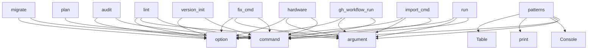

# System Architecture Analysis
<!-- generated in 0.00s -->

## Overview

- **Project**: /home/tom/github/maskservice/redeploy
- **Primary Language**: python
- **Languages**: python: 220, md: 44, yaml: 37, yml: 3, shell: 2
- **Analysis Mode**: static
- **Total Functions**: 985
- **Total Classes**: 179
- **Modules**: 309
- **Entry Points**: 582

## Architecture by Module

### redeploy.cli.display
- **Functions**: 25
- **File**: `display.py`

### redeploy.fleet
- **Functions**: 23
- **Classes**: 6
- **File**: `fleet.py`

### redeploy.iac.docker_compose
- **Functions**: 23
- **Classes**: 1
- **File**: `docker_compose.py`

### redeploy.apply.handlers
- **Functions**: 22
- **File**: `handlers.py`

### redeploy.plan.planner
- **Functions**: 21
- **Classes**: 1
- **File**: `planner.py`

### redeploy.cli.commands.version.scanner
- **Functions**: 18
- **File**: `scanner.py`

### redeploy.iac.parsers.compose
- **Functions**: 18
- **Classes**: 1
- **File**: `compose.py`

### redeploy.ssh
- **Functions**: 17
- **Classes**: 4
- **File**: `ssh.py`

### redeploy.apply.executor
- **Functions**: 17
- **Classes**: 1
- **File**: `executor.py`

### redeploy.mcp_server
- **Functions**: 15
- **File**: `mcp_server.py`

### redeploy.cli.commands.gh_workflow
- **Functions**: 15
- **File**: `gh_workflow.py`

### redeploy.version.changelog
- **Functions**: 15
- **Classes**: 1
- **File**: `changelog.py`

### redeploy.iac.config_hints
- **Functions**: 15
- **Classes**: 1
- **File**: `config_hints.py`

### redeploy.observe
- **Functions**: 14
- **Classes**: 3
- **File**: `observe.py`

### redeploy.detect.templates
- **Functions**: 13
- **Classes**: 6
- **File**: `templates.py`

### redeploy.models.devices
- **Functions**: 13
- **Classes**: 4
- **File**: `devices.py`

### redeploy.audit.auditor
- **Functions**: 13
- **Classes**: 1
- **File**: `auditor.py`

### redeploy.apply.state
- **Functions**: 13
- **Classes**: 1
- **File**: `state.py`

### redeploy.version.git_integration
- **Functions**: 13
- **Classes**: 2
- **File**: `git_integration.py`

### redeploy.iac.base
- **Functions**: 13
- **Classes**: 7
- **File**: `base.py`

## Key Entry Points

Main execution flows into the system:

### redeploy.cli.commands.run_cmd.run
> Execute migration from a single YAML spec (source + target in one file).
- **Calls**: click.command, click.argument, click.option, click.option, click.option, click.option, click.option, click.option

### redeploy.cli.commands.import_.import_cmd
> Parse an IaC/CI-CD file and produce a migration.yaml scaffold.

    Auto-detects format from filename. Built-in parsers cover:
    docker-compose, Doc
- **Calls**: click.command, click.argument, click.option, click.option, click.option, click.option, click.option, click.option

### redeploy.cli.commands.version.commands.version_init
> Initialize .redeploy/version.yaml manifest.
- **Calls**: version_cmd.command, click.option, click.option, click.option, click.option, click.option, Console, Path

### redeploy.cli.commands.audit.audit
> Show deploy audit log from ~/.config/redeploy/audit.jsonl.


Examples:
    redeploy audit
    redeploy audit --last 50 --failed
    redeploy audit --
- **Calls**: click.command, click.option, click.option, click.option, click.option, click.option, click.option, click.option

### redeploy.cli.commands.patterns.patterns
> List available deploy patterns or show detail for one.


Examples:
    redeploy patterns
    redeploy patterns blue_green
    redeploy patterns canar
- **Calls**: click.command, click.argument, Console, console.print, Table, t.add_column, t.add_column, t.add_column

### redeploy.cli.commands.gh_workflow.gh_workflow_run
> Trigger a GitHub Actions workflow_dispatch run on demand via gh CLI.
- **Calls**: gh_workflow_cmd.command, click.argument, click.option, click.option, click.option, click.option, click.option, Console

### redeploy.cli.commands.hardware.hardware
> Probe and diagnose hardware on a remote host.

Checks DSI display, DRM connectors, backlight controller, I2C buses,
config.txt overlays and Wayland co
- **Calls**: click.command, click.argument, click.option, click.option, click.option, click.option, click.option, click.option

### redeploy.cli.commands.bump_fix.fix_cmd
> Self-healing deploy: bump version, then run with LLM auto-fix on failure.


PATH is a spec file or directory containing migration.yaml / migration.md
- **Calls**: click.command, click.argument, click.option, click.option, click.option, click.option, click.option, click.option

### redeploy.cli.commands.lint.lint
> Static analysis of a migration spec (YAML or markpact .md).

Detects missing files, broken references, missing command_ref blocks,
docker-compose inco
- **Calls**: click.command, click.argument, click.option, click.option, click.option, Console, ProjectManifest.find_and_load, redeploy.cli.core.load_spec_or_exit

### redeploy.cli.commands.migrate_cmd.migrate
> Full pipeline: detect → plan → apply.
- **Calls**: click.command, click.option, click.option, click.option, click.option, click.option, click.option, click.option

### redeploy.cli.commands.plan_cmd.plan
> Generate migration-plan.yaml from infra.yaml + target config.
- **Calls**: click.command, click.option, click.option, click.option, click.option, click.option, click.option, click.option

### redeploy.heal.runner.HealRunner._heal_step
> Single heal iteration: diagnose → LLM → decide.

Returns *(decision, failed_step, loop_hint)*.
- **Calls**: redeploy.heal.parse_failed_step, self.console.print, self.console.print, redeploy.heal.collect_diagnostics, next, os.getenv, self.console.print, self.spec_path.read_text

### redeploy.cli.commands.exec_.exec_cmd
> Execute a script from a markdown codeblock by reference.

REF format: #section-id or ./file.md#section-id or just ref-id (for markpact:ref)

Extracts 
- **Calls**: click.command, click.argument, click.option, click.option, click.option, click.option, Console, console.print

### examples.redeploy_iac_parsers.argocd_flux.FluxKustomizationParser.parse
- **Calls**: ParsedSpec, str, None.strip, None.strip, None.strip, None.strip, None.strip, None.strip

### redeploy.cli.commands.push.push
> Apply desired-state YAML/JSON file(s) to a remote host.

Reads each FILE, detects its schema (hardware, infra, …) and applies
only the settings that d
- **Calls**: click.command, click.argument, click.argument, click.option, click.option, Console, console.print, RemoteProbe

### redeploy.cli.commands.version.commands.version_bump
> Bump version across all sources atomically.

Examples:
    redeploy version bump patch
    redeploy version bump patch --commit --tag --push
    redep
- **Calls**: version_cmd.command, click.argument, click.option, click.option, click.option, click.option, click.option, click.option

### redeploy.cli.commands.device_map.device_map_cmd
> Generate a full standardized device snapshot (hardware + infra + diagnostics).
- **Calls**: click.command, click.argument, click.option, click.option, click.option, click.option, click.option, click.option

### redeploy.cli.commands.plugin.plugin_cmd
> List or inspect registered redeploy plugins.


Examples:
    redeploy plugin list
    redeploy plugin info browser_reload
    redeploy plugin info sy
- **Calls**: click.command, click.argument, click.argument, Console, redeploy.plugins.load_user_plugins, registry.names, registry.names, console.print

### redeploy.cli.commands.version.commands.version_list
> List all version sources and their values.
- **Calls**: version_cmd.command, click.option, click.option, click.option, Console, Path, VersionManifest.load, redeploy.cli.commands.version.helpers._resolve_monorepo_targets

### redeploy.iac.config_hints.ConfigHintsParser._parse_k8s_yaml
- **Calls**: self._new_spec, redeploy.steps.StepLibrary.list, spec.runtime_hints.append, yaml.safe_load_all, None.lower, str, path.read_text, isinstance

### examples.redeploy_iac_parsers.argocd_flux.ArgoCDApplicationParser.parse
- **Calls**: ParsedSpec, str, None.strip, None.strip, None.strip, None.strip, None.strip, None.strip

### redeploy.cli.commands.prompt_cmd.prompt_cmd
> Natural-language → redeploy command via LLM.


INSTRUCTION is a free-text description of what you want to do.


Examples:
    redeploy prompt "deplo
- **Calls**: click.command, click.argument, click.option, click.option, click.option, click.option, Console, redeploy.schema.build_schema

### redeploy.cli.commands.blueprint._print_blueprint
- **Calls**: console.print, console.print, console.print, console.print, console.print, click.echo, click.echo, None.join

### redeploy.cli.commands.exec_.exec_multi_cmd
> Execute multiple scripts from markdown codeblocks by reference.

REFS format: comma-separated list of ref ids (markpact:ref or section headings)


Ex
- **Calls**: click.command, click.argument, click.option, click.option, click.option, click.option, click.option, Console

### redeploy.cli.commands.blueprint.capture
> Probe HOST and extract a DeviceBlueprint from all available sources.
- **Calls**: blueprint_cmd.command, click.argument, click.option, click.option, click.option, click.option, click.option, click.option

### redeploy.cli.commands.detect.detect
> Probe infrastructure and produce infra.yaml.

With --workflow: multi-host detection with template scoring.
Reads hosts from redeploy.yaml / redeploy.c
- **Calls**: click.command, click.option, click.option, click.option, click.option, click.option, click.option, click.option

### redeploy.iac.docker_compose.DockerComposeParser.parse
- **Calls**: ParsedSpec, self._load_merged, self._load_dotenv, set, services_raw.items, spec.runtime_hints.append, spec.add_warning, data.get

### redeploy.iac.config_hints.ConfigHintsParser._parse_github_actions
- **Calls**: self._new_spec, isinstance, yaml.safe_load, isinstance, raw.get, isinstance, raw.get, spec.triggers.extend

### redeploy.cli.commands.devices.scan
> Discover SSH-accessible devices on the local network.

Sources (passive by default, zero packets unless --ping):
  known_hosts  — parse ~/.ssh/known_h
- **Calls**: click.command, click.option, click.option, click.option, click.option, click.option, click.option, click.option

### redeploy.detect.detector.Detector.run
- **Calls**: logger.info, logger.debug, redeploy.detect.probes.probe_runtime, logger.debug, logger.debug, redeploy.detect.probes.probe_ports, logger.debug, logger.debug

## Process Flows

Key execution flows identified:

### Flow 1: run
```
run [redeploy.cli.commands.run_cmd]
```

### Flow 2: import_cmd
```
import_cmd [redeploy.cli.commands.import_]
```

### Flow 3: version_init
```
version_init [redeploy.cli.commands.version.commands]
```

### Flow 4: audit
```
audit [redeploy.cli.commands.audit]
```

### Flow 5: patterns
```
patterns [redeploy.cli.commands.patterns]
```

### Flow 6: gh_workflow_run
```
gh_workflow_run [redeploy.cli.commands.gh_workflow]
```

### Flow 7: hardware
```
hardware [redeploy.cli.commands.hardware]
```

### Flow 8: fix_cmd
```
fix_cmd [redeploy.cli.commands.bump_fix]
```

### Flow 9: lint
```
lint [redeploy.cli.commands.lint]
```

### Flow 10: migrate
```
migrate [redeploy.cli.commands.migrate_cmd]
```

## Key Classes

### redeploy.plan.planner.Planner
> Generate a MigrationPlan from detected infra + desired target.
- **Methods**: 21
- **Key Methods**: redeploy.plan.planner.Planner.__init__, redeploy.plan.planner.Planner.run, redeploy.plan.planner.Planner._plan_conflict_fixes, redeploy.plan.planner.Planner._plan_stop_old_services, redeploy.plan.planner.Planner._plan_deploy_new, redeploy.plan.planner.Planner._plan_docker_full, redeploy.plan.planner.Planner._plan_podman_quadlet, redeploy.plan.planner.Planner._plan_kiosk, redeploy.plan.planner.Planner._plan_kiosk_appliance, redeploy.plan.planner.Planner._plan_systemd

### redeploy.apply.executor.Executor
> Execute MigrationPlan steps on a remote host.
- **Methods**: 20
- **Key Methods**: redeploy.apply.executor.Executor.__init__, redeploy.apply.executor.Executor.completed_steps, redeploy.apply.executor.Executor.state, redeploy.apply.executor.Executor.state_path, redeploy.apply.executor.Executor.run, redeploy.apply.executor.Executor._execute_steps_loop, redeploy.apply.executor.Executor._skip_step, redeploy.apply.executor.Executor._handle_step_failure, redeploy.apply.executor.Executor._handle_completion, redeploy.apply.executor.Executor._fire_hooks

### redeploy.observe.AuditEntry
> Single audit log entry — immutable snapshot of one deployment.
- **Methods**: 18
- **Key Methods**: redeploy.observe.AuditEntry.__init__, redeploy.observe.AuditEntry.ts, redeploy.observe.AuditEntry.host, redeploy.observe.AuditEntry.app, redeploy.observe.AuditEntry.from_strategy, redeploy.observe.AuditEntry.to_strategy, redeploy.observe.AuditEntry.ok, redeploy.observe.AuditEntry.elapsed_s, redeploy.observe.AuditEntry.steps_total, redeploy.observe.AuditEntry.steps_ok

### redeploy.iac.docker_compose.DockerComposeParser
> Parser for docker-compose.yml / compose.yaml files.
- **Methods**: 18
- **Key Methods**: redeploy.iac.docker_compose.DockerComposeParser.can_parse, redeploy.iac.docker_compose.DockerComposeParser.parse, redeploy.iac.docker_compose.DockerComposeParser._load_merged, redeploy.iac.docker_compose.DockerComposeParser._find_override, redeploy.iac.docker_compose.DockerComposeParser._load_dotenv, redeploy.iac.docker_compose.DockerComposeParser._resolve_image_and_build, redeploy.iac.docker_compose.DockerComposeParser._parse_service_ports, redeploy.iac.docker_compose.DockerComposeParser._parse_service_volumes, redeploy.iac.docker_compose.DockerComposeParser._parse_service_env, redeploy.iac.docker_compose.DockerComposeParser._parse_service_env_files

### redeploy.iac.parsers.compose.DockerComposeParser
> Parser for Docker Compose files (v2 + v3 schema, Compose Spec).
- **Methods**: 18
- **Key Methods**: redeploy.iac.parsers.compose.DockerComposeParser.can_parse, redeploy.iac.parsers.compose.DockerComposeParser.parse, redeploy.iac.parsers.compose.DockerComposeParser._collect_service_secrets, redeploy.iac.parsers.compose.DockerComposeParser._merge_service_env_files, redeploy.iac.parsers.compose.DockerComposeParser._collect_service_image, redeploy.iac.parsers.compose.DockerComposeParser._parse_service_networks, redeploy.iac.parsers.compose.DockerComposeParser._parse_service_replicas, redeploy.iac.parsers.compose.DockerComposeParser._parse_service, redeploy.iac.parsers.compose.DockerComposeParser._parse_build, redeploy.iac.parsers.compose.DockerComposeParser._parse_command

### redeploy.fleet.Fleet
> Unified first-class fleet — wraps FleetConfig and/or DeviceRegistry.

Provides a single query interf
- **Methods**: 15
- **Key Methods**: redeploy.fleet.Fleet.__init__, redeploy.fleet.Fleet.from_file, redeploy.fleet.Fleet.from_registry, redeploy.fleet.Fleet.from_config, redeploy.fleet.Fleet.devices, redeploy.fleet.Fleet.get, redeploy.fleet.Fleet.by_tag, redeploy.fleet.Fleet.by_stage, redeploy.fleet.Fleet.by_strategy, redeploy.fleet.Fleet.prod

### redeploy.ssh.SshClient
> Execute commands on a remote host via SSH (or locally).

Args:
    host:     ``user@ip`` string, or 
- **Methods**: 15
- **Key Methods**: redeploy.ssh.SshClient.__init__, redeploy.ssh.SshClient.key, redeploy.ssh.SshClient.key, redeploy.ssh.SshClient.run, redeploy.ssh.SshClient.rsync, redeploy.ssh.SshClient.scp, redeploy.ssh.SshClient.put_file, redeploy.ssh.SshClient.is_reachable, redeploy.ssh.SshClient.is_ssh_ready, redeploy.ssh.SshClient.ping

### redeploy.version.changelog.ChangelogManager
> Manage CHANGELOG.md in keep-a-changelog format.
- **Methods**: 14
- **Key Methods**: redeploy.version.changelog.ChangelogManager.__init__, redeploy.version.changelog.ChangelogManager.exists, redeploy.version.changelog.ChangelogManager.read, redeploy.version.changelog.ChangelogManager._default_template, redeploy.version.changelog.ChangelogManager.get_unreleased_section, redeploy.version.changelog.ChangelogManager.prepare_release, redeploy.version.changelog.ChangelogManager._format_release_content, redeploy.version.changelog.ChangelogManager._init_categories, redeploy.version.changelog.ChangelogManager._categorize_commits, redeploy.version.changelog.ChangelogManager._format_commit_entry

### redeploy.iac.config_hints.ConfigHintsParser
> Best-effort parser for common DevOps/IaC config files.
- **Methods**: 14
- **Key Methods**: redeploy.iac.config_hints.ConfigHintsParser.can_parse, redeploy.iac.config_hints.ConfigHintsParser.parse, redeploy.iac.config_hints.ConfigHintsParser._new_spec, redeploy.iac.config_hints.ConfigHintsParser._read_text, redeploy.iac.config_hints.ConfigHintsParser._parse_dockerfile, redeploy.iac.config_hints.ConfigHintsParser._parse_nginx, redeploy.iac.config_hints.ConfigHintsParser._looks_like_k8s, redeploy.iac.config_hints.ConfigHintsParser._parse_k8s_yaml, redeploy.iac.config_hints.ConfigHintsParser._parse_terraform, redeploy.iac.config_hints.ConfigHintsParser._parse_toml

### redeploy.audit.auditor.Auditor
- **Methods**: 13
- **Key Methods**: redeploy.audit.auditor.Auditor.__init__, redeploy.audit.auditor.Auditor.run, redeploy.audit.auditor.Auditor._add_disk_check, redeploy.audit.auditor.Auditor._probe_one, redeploy.audit.auditor.Auditor._check, redeploy.audit.auditor.Auditor._probe_binary, redeploy.audit.auditor.Auditor._probe_directory, redeploy.audit.auditor.Auditor._probe_file, redeploy.audit.auditor.Auditor._probe_local_file, redeploy.audit.auditor.Auditor._probe_port_listening

### redeploy.version.git_integration.GitIntegration
> Git operations for version management.
- **Methods**: 13
- **Key Methods**: redeploy.version.git_integration.GitIntegration.__init__, redeploy.version.git_integration.GitIntegration._run, redeploy.version.git_integration.GitIntegration.require_clean, redeploy.version.git_integration.GitIntegration.is_clean, redeploy.version.git_integration.GitIntegration.get_dirty_files, redeploy.version.git_integration.GitIntegration.stage_files, redeploy.version.git_integration.GitIntegration.commit, redeploy.version.git_integration.GitIntegration.tag, redeploy.version.git_integration.GitIntegration.push, redeploy.version.git_integration.GitIntegration.tag_exists

### redeploy.heal.HealRunner
> Wraps Executor with self-healing loop.

Parameters
----------
migration : Migration
    Planned migr
- **Methods**: 11
- **Key Methods**: redeploy.heal.HealRunner.__init__, redeploy.heal.HealRunner._make_executor, redeploy.heal.HealRunner._reload_migration, redeploy.heal.HealRunner._run_executor_attempt, redeploy.heal.HealRunner._collect_diag_with_hint, redeploy.heal.HealRunner._extract_diag_hint, redeploy.heal.HealRunner._ask_and_apply_fix, redeploy.heal.HealRunner._record_repair, redeploy.heal.HealRunner._is_repeating_loop, redeploy.heal.HealRunner._retry_after_heal

### redeploy.verify.VerifyContext
> Accumulates check results during verification.
- **Methods**: 11
- **Key Methods**: redeploy.verify.VerifyContext.check, redeploy.verify.VerifyContext.add_pass, redeploy.verify.VerifyContext.add_fail, redeploy.verify.VerifyContext.add_warn, redeploy.verify.VerifyContext.add_info, redeploy.verify.VerifyContext.passed, redeploy.verify.VerifyContext.failed, redeploy.verify.VerifyContext.warned, redeploy.verify.VerifyContext.total, redeploy.verify.VerifyContext.ok

### redeploy.apply.progress.ProgressEmitter
> Emits YAML-formatted progress events to a stream (default: stdout).

Each event is a YAML document (
- **Methods**: 11
- **Key Methods**: redeploy.apply.progress.ProgressEmitter.__init__, redeploy.apply.progress.ProgressEmitter._ts, redeploy.apply.progress.ProgressEmitter._elapsed, redeploy.apply.progress.ProgressEmitter._emit, redeploy.apply.progress.ProgressEmitter.start, redeploy.apply.progress.ProgressEmitter.step_start, redeploy.apply.progress.ProgressEmitter.step_done, redeploy.apply.progress.ProgressEmitter.step_fail, redeploy.apply.progress.ProgressEmitter.progress, redeploy.apply.progress.ProgressEmitter.done

### redeploy.apply.state.ResumeState
> Checkpoint for a single MigrationPlan execution.
- **Methods**: 10
- **Key Methods**: redeploy.apply.state.ResumeState.load, redeploy.apply.state.ResumeState.load_or_new, redeploy.apply.state.ResumeState.save, redeploy.apply.state.ResumeState.remove, redeploy.apply.state.ResumeState.mark_done, redeploy.apply.state.ResumeState.mark_failed, redeploy.apply.state.ResumeState.reset, redeploy.apply.state.ResumeState.is_done, redeploy.apply.state.ResumeState.completed_count, redeploy.apply.state.ResumeState.remaining
- **Inherits**: BaseModel

### redeploy.models.devices.DeviceRegistry
> Persistent device registry — stored at ~/.config/redeploy/devices.yaml.
- **Methods**: 9
- **Key Methods**: redeploy.models.devices.DeviceRegistry.get, redeploy.models.devices.DeviceRegistry.upsert, redeploy.models.devices.DeviceRegistry.remove, redeploy.models.devices.DeviceRegistry.by_tag, redeploy.models.devices.DeviceRegistry.by_strategy, redeploy.models.devices.DeviceRegistry.reachable, redeploy.models.devices.DeviceRegistry.default_path, redeploy.models.devices.DeviceRegistry.load, redeploy.models.devices.DeviceRegistry.save
- **Inherits**: BaseModel

### redeploy.models.hardware.HardwareInfo
> Hardware state produced by hardware probe.
- **Methods**: 8
- **Key Methods**: redeploy.models.hardware.HardwareInfo.has_dsi, redeploy.models.hardware.HardwareInfo.kms_enabled, redeploy.models.hardware.HardwareInfo.dsi_connected, redeploy.models.hardware.HardwareInfo.dsi_physically_connected, redeploy.models.hardware.HardwareInfo.dsi_enabled, redeploy.models.hardware.HardwareInfo.backlight_on, redeploy.models.hardware.HardwareInfo.errors, redeploy.models.hardware.HardwareInfo.warnings
- **Inherits**: BaseModel

### redeploy.audit.probe.Probe
> Thin wrapper around SshClient with sensible audit timeouts.
- **Methods**: 8
- **Key Methods**: redeploy.audit.probe.Probe.__init__, redeploy.audit.probe.Probe.has_binary, redeploy.audit.probe.Probe.has_path, redeploy.audit.probe.Probe.port_listening, redeploy.audit.probe.Probe.has_image, redeploy.audit.probe.Probe.has_systemd_unit, redeploy.audit.probe.Probe.apt_package, redeploy.audit.probe.Probe.disk_free_gib

### redeploy.audit.models.AuditReport
- **Methods**: 8
- **Key Methods**: redeploy.audit.models.AuditReport.add, redeploy.audit.models.AuditReport.passed, redeploy.audit.models.AuditReport.failed, redeploy.audit.models.AuditReport.warned, redeploy.audit.models.AuditReport.skipped, redeploy.audit.models.AuditReport.ok, redeploy.audit.models.AuditReport.summary, redeploy.audit.models.AuditReport.to_dict

### redeploy.version.manifest.VersionManifest
> Root manifest model for .redeploy/version.yaml.
- **Methods**: 8
- **Key Methods**: redeploy.version.manifest.VersionManifest.load, redeploy.version.manifest.VersionManifest.save, redeploy.version.manifest.VersionManifest.format_version, redeploy.version.manifest.VersionManifest.get_source_paths, redeploy.version.manifest.VersionManifest.get_package, redeploy.version.manifest.VersionManifest.list_packages, redeploy.version.manifest.VersionManifest.is_monorepo, redeploy.version.manifest.VersionManifest.get_all_package_versions
- **Inherits**: BaseModel

## Data Transformation Functions

Key functions that process and transform data:

### redeploy.schema._parse_spec_meta
> Extract version, name, target from a migration spec (YAML or Markdown).
- **Output to**: path.read_text, re.search, None.strip, None.strip, None.strip

### redeploy.heal.parse_failed_step
> Extract (step_id, step_output) from executor state or summary string.
- **Output to**: re.search, getattr, getattr, results.get, isinstance

### redeploy.parse.parse_docker_ps
> Parse 'docker ps --format "{{.Names}}|{{.Image}}|{{.Status}}|{{.Ports}}|{{.State}}"' output.
- **Output to**: output.split, line.strip, line.split, line.startswith, len

### redeploy.parse.parse_container_line
> Parse a single NAME|STATUS|IMAGE pipe-delimited container line.
- **Output to**: line.split, len, len

### redeploy.parse.parse_system_info
> Parse KEY:VALUE system info lines (HOSTNAME, UPTIME, DISK, MEM, LOAD) into a dict.
- **Output to**: output.split, line.strip, line.startswith, line.startswith, line.startswith

### redeploy.parse.parse_diagnostics
> Parse multi-section SSH diagnostics output into structured dict.

Handles sections: ===SYSTEM===, ==
- **Output to**: output.split, raw_line.strip, line.startswith, redeploy.parse._parse_section_line

### redeploy.parse._parse_section_line
- **Output to**: redeploy.parse._apply_system_line, redeploy.parse.parse_container_line, None.append, redeploy.parse._apply_git_line, redeploy.parse._apply_health_line

### redeploy.parse.parse_health_info
> Parse health-check SSH output (HOSTNAME, UPTIME, HEALTH, DISK, LOAD) into a dict.
- **Output to**: output.split, line.strip, _HEALTH_PREFIXES.items, line.startswith, line.startswith

### redeploy.mcp_server._validate_exec_ssh_inputs
> Return validation error message for unsafe exec_ssh inputs, or None.
- **Output to**: _SAFE_HOST_RE.match, None.lower, os.getenv

### redeploy.heal.decider.format_decision_message
> Human-readable log / console message for a decision.
- **Output to**: decision.action.value.upper

### redeploy.heal.hint_provider._parse_step_block
- **Output to**: isinstance, yaml.safe_load, isinstance, isinstance

### redeploy.heal.hint_provider.parse_failed_step
> Extract (step_id, step_output) from executor state or summary string.
- **Output to**: re.search, getattr, getattr, results.get, isinstance

### redeploy.discovery_probe.parse_probe_output
- **Output to**: out.splitlines, line.strip, line.startswith, line.startswith, line.split

### redeploy.analyze.checkers.docker_build.parse_docker_build
- **Output to**: FILE_FLAG_RE.finditer, cmd.split, len, token.startswith, match.group

### redeploy.config_apply.handlers.display._validate_display_inputs
- **Output to**: _SAFE_OUTPUT_RE.match, ValueError, ValueError, sorted

### redeploy.config_apply.handlers.display.apply_display_transform
> Apply *transform* to *output_name* via wlr-randr and persist in kanshi config.

Parameters
---------
- **Output to**: redeploy.config_apply.handlers.display._validate_display_inputs, console.print, probe.run, shlex.quote, probe.run

### redeploy.cli.display._format_workflow_header
> Format workflow header string.
- **Output to**: len

### redeploy.cli.commands.plan_apply_report._parse_rsync_output
- **Output to**: ln.rstrip, str, len, None.splitlines, ln.strip

### redeploy.cli.commands.gh_workflow._parse_fields
- **Output to**: parsed.append, click.ClickException

### redeploy.cli.commands.hardware._format_output
> Format output as yaml/json, return True if formatted.
- **Output to**: click.echo, click.echo, yaml.safe_dump, _json.dumps, hw.model_dump

### redeploy.cli.commands.hardware._apply_transform
> Apply display transform via wlr-randr and persist in kanshi config.
- **Output to**: next, redeploy.config_apply.handlers.display.apply_display_transform, console.print, sys.exit

### redeploy.cli.commands.prompt_cmd._parse_llm_response
> Parse JSON from LLM response, strip accidental fences and escape control characters.
- **Output to**: raw.strip, clean.startswith, _extract_json, re.sub, re.sub

### redeploy.cli.commands.version.release._format_release_tag
> Format release tag from git config.
- **Output to**: git_config.tag_format.format

### redeploy.cli.commands.version.scanner._format_version_scan_source_status
> Format version scan source status.
- **Output to**: None.join, parts.append

### redeploy.plugins.builtin.process_control._kill_process
> Kill a process by PID. Returns True if successful.
- **Output to**: os.kill, logger.warning

## Behavioral Patterns

### recursion_probe_hardware
- **Type**: recursion
- **Confidence**: 0.90
- **Functions**: redeploy.detect.detector.Detector.probe_hardware

### recursion_list
- **Type**: recursion
- **Confidence**: 0.90
- **Functions**: redeploy.dsl_python.decorators.MigrationRegistry.list

### recursion__deep_merge
- **Type**: recursion
- **Confidence**: 0.90
- **Functions**: redeploy.markpact.compiler._deep_merge

### recursion__parse_port
- **Type**: recursion
- **Confidence**: 0.90
- **Functions**: redeploy.iac.docker_compose._parse_port

### recursion__deep_merge
- **Type**: recursion
- **Confidence**: 0.90
- **Functions**: redeploy.iac.docker_compose._deep_merge

### state_machine_HardwareInfo
- **Type**: state_machine
- **Confidence**: 0.70
- **Functions**: redeploy.models.hardware.HardwareInfo.has_dsi, redeploy.models.hardware.HardwareInfo.kms_enabled, redeploy.models.hardware.HardwareInfo.dsi_connected, redeploy.models.hardware.HardwareInfo.dsi_physically_connected, redeploy.models.hardware.HardwareInfo.dsi_enabled

### state_machine_step
- **Type**: state_machine
- **Confidence**: 0.70
- **Functions**: redeploy.dsl_python.decorators.step.__enter__, redeploy.dsl_python.decorators.step.__exit__

### state_machine_ResumeState
- **Type**: state_machine
- **Confidence**: 0.70
- **Functions**: redeploy.apply.state.ResumeState.load, redeploy.apply.state.ResumeState.load_or_new, redeploy.apply.state.ResumeState.save, redeploy.apply.state.ResumeState.remove, redeploy.apply.state.ResumeState.mark_done

### state_machine_StateHandler
- **Type**: state_machine
- **Confidence**: 0.70
- **Functions**: redeploy.apply.state_apply.StateHandler.accept, redeploy.apply.state_apply.StateHandler.apply

### state_machine_HardwareStateHandler
- **Type**: state_machine
- **Confidence**: 0.70
- **Functions**: redeploy.apply.state_apply.HardwareStateHandler.accept, redeploy.apply.state_apply.HardwareStateHandler.apply

### state_machine_InfraStateHandler
- **Type**: state_machine
- **Confidence**: 0.70
- **Functions**: redeploy.apply.state_apply.InfraStateHandler.accept, redeploy.apply.state_apply.InfraStateHandler.apply

### state_machine_Executor
- **Type**: state_machine
- **Confidence**: 0.70
- **Functions**: redeploy.apply.executor.Executor.__init__, redeploy.apply.executor.Executor.completed_steps, redeploy.apply.executor.Executor.state, redeploy.apply.executor.Executor.state_path, redeploy.apply.executor.Executor.run

## Public API Surface

Functions exposed as public API (no underscore prefix):

- `redeploy.cli.commands.run_cmd.run` - 69 calls
- `redeploy.cli.commands.import_.import_cmd` - 56 calls
- `redeploy.cli.commands.version.commands.version_init` - 56 calls
- `redeploy.cli.commands.audit.audit` - 51 calls
- `redeploy.cli.commands.patterns.patterns` - 50 calls
- `redeploy.cli.commands.gh_workflow.gh_workflow_run` - 49 calls
- `redeploy.integrations.op3_bridge.snapshot_to_hardware_info` - 49 calls
- `redeploy.cli.commands.hardware.hardware` - 47 calls
- `redeploy.cli.commands.bump_fix.fix_cmd` - 44 calls
- `redeploy.cli.commands.lint.lint` - 44 calls
- `redeploy.cli.commands.migrate_cmd.migrate` - 43 calls
- `redeploy.cli.commands.plan_cmd.plan` - 41 calls
- `redeploy.cli.commands.exec_.exec_cmd` - 40 calls
- `examples.redeploy_iac_parsers.argocd_flux.FluxKustomizationParser.parse` - 40 calls
- `redeploy.cli.commands.push.push` - 39 calls
- `redeploy.cli.commands.version.commands.version_bump` - 39 calls
- `redeploy.cli.commands.device_map.device_map_cmd` - 39 calls
- `redeploy.cli.commands.plugin.plugin_cmd` - 38 calls
- `redeploy.cli.commands.version.commands.version_list` - 38 calls
- `examples.redeploy_iac_parsers.argocd_flux.ArgoCDApplicationParser.parse` - 38 calls
- `redeploy.cli.commands.prompt_cmd.prompt_cmd` - 37 calls
- `redeploy.cli.commands.device_map_actions.print_device_map_diff` - 36 calls
- `redeploy.cli.commands.exec_.exec_multi_cmd` - 35 calls
- `redeploy.cli.commands.blueprint.capture` - 35 calls
- `redeploy.cli.commands.detect.detect` - 35 calls
- `redeploy.iac.docker_compose.DockerComposeParser.parse` - 33 calls
- `redeploy.discovery.auto_probe.auto_probe` - 33 calls
- `redeploy.cli.commands.target.target` - 31 calls
- `redeploy.cli.commands.devices.scan` - 31 calls
- `redeploy.detect.detector.Detector.run` - 30 calls
- `redeploy.heal.hint_provider.apply_fix_to_spec` - 30 calls
- `redeploy.dsl_python.runner.PythonMigrationRunner.run_file` - 30 calls
- `redeploy.cli.commands.init.init` - 29 calls
- `redeploy.cli.commands.version.commands.version_set` - 29 calls
- `examples.redeploy_iac_parsers.gitops_ci.GitHubActionsGitOpsParser.parse` - 29 calls
- `redeploy.apply.state_apply.HardwareStateHandler.apply` - 27 calls
- `examples.redeploy_iac_parsers.helm_kustomize.HelmTemplatesParser.parse` - 27 calls
- `redeploy.cli.commands.status.status` - 26 calls
- `redeploy.plugins.builtin.browser_reload.browser_reload` - 26 calls
- `redeploy.apply.handlers.run_ensure_kanshi_profile` - 26 calls

## System Interactions

How components interact:



## Reverse Engineering Guidelines

1. **Entry Points**: Start analysis from the entry points listed above
2. **Core Logic**: Focus on classes with many methods
3. **Data Flow**: Follow data transformation functions
4. **Process Flows**: Use the flow diagrams for execution paths
5. **API Surface**: Public API functions reveal the interface

## Context for LLM

Maintain the identified architectural patterns and public API surface when suggesting changes.